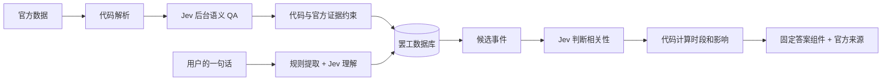
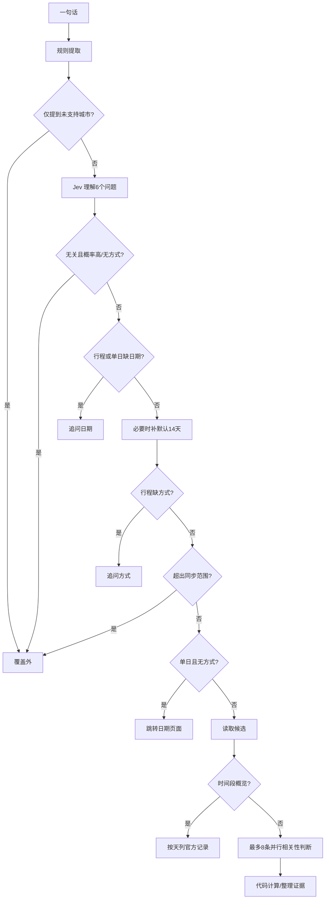

# AI 如何工作：Claude Ask 与后台 Jev QA 的完整决策说明

核对日期：2026-10-06。后端核验基准 `6527caa`，并对照 Claude 最新的 `3e2440b`；两版 Ask / QA 核心相同，最新 Ask 界面只改变分享链接。本文解释真实实现，不把早期原型文档当当前事实。

## 一、先用人话说明架构

网站有两套 AI 用法。它们都使用固定的 `typesafe/jev-1.13`，但任务不同。

**后台 QA**：代码先读官方公告并生成结构化罢工，Jev 再检查“你是不是把机构所在地误当影响地区”“是不是把安保人员说成列车司机”等语义问题。模型只能在提供的候选中选择；改数据库前还要经过官方证据和代码约束。

**用户 Ask**：用户输入“周五早上 9 点坐 M1 会受影响吗”。代码读出周五、09:00、米兰、地铁、M1；Jev 判断用户想查行程，以及检索到的罢工是否与这段行程有关。代码再算时间重叠、整理证据，前端用固定组件回答。

模型不会替我们抓网页，不是事实来源，不生成自由回答，也不决定火车几点开、保障时间或某条线路是否实际停运。

主要作者分工：Claude 编写 Ask 产品逻辑、自然语言规则、决策问题和界面；Codex 接入后台 QA，并给 Ask 补共享预算、服务端会话与限流、证据契约和覆盖边界。当前不是两套互不相干的数据源。

## 二、什么叫“决策分支数”

这里有不同口径，不能把所有 if 或所有概率随意相加，说成一个巨大的决策树。

| 口径 | Claude Ask 当前数量 | 后台 QA 当前数量 |
|---|---|---|
| 一次理解／审核请求里的模型问题 | Ask 理解 **6 个**：意图、用途、4 个方式 | QA **7 个**：3 个选择题、4 个风险概率 |
| 单个候选的模型问题 | 普通查询 **3 个**；核实消息 **4 个** | 按公告统一审核，不逐城市重复提问 |
| 意图的离散选项 | **5 个** | 不询问用户意图 |
| 结果接口最外层类型 | **4 个**：clarify / navigate / out_of_scope / result | **5 个**处置状态 |
| 结果展示类型 | result 内 **4 个**：trip / day / period / claim | 不是用户答案组件 |
| 影响标签 | **6 个**事件等级，另有无相关记录的 clear，共 **7 个** | 不由模型决定用户影响等级 |
| 付费请求上限 | 每次服务端处理 **1 + 最多 8 = 9 次** | 单次同步 **最多 30 次**，按官方公告分组 |

“noul”返回的是 0–1 的风险或相关性概率，不是只给 true/false；代码阈值才把它转成动作。“choice”返回一个枚举项及概率分布。问题、枚举数量、API 类型数量和调用次数是四件事。

## 三、Claude Ask：从输入到回答

### 1. 输入与免费规则提取

入口 `POST /api/ask`，用户问题最多 200 字，请求体最多 8 KB，城市必须在 registry，hints 日期必须是真实日期，方式最多四项。先通过共享频率限制和服务端会话，再运行 `runAsk()`。

代码识别：

- 中文、英文、意大利文的日期和相对日期：今天、明天、周五、下周、月份、近期等；统一罗马日期。
- 明确时刻，例如 09:00、下午 3 点、8:30pm。
- 没有明确时刻时，早上／下午／晚上等粗时间段；这是公开的假设。
- 已支持城市、机场名字、交通关键词，以及部分线路形式。
- 当前线路识别主要是 M1–M5、S/R/RE 数字线路和中文数字号线；**不是任意公交、GEST T1/T2 或全国线路名称都能完整解析**。
- 通勤／上学，以及部分境外目的地。
- 用户追问时选择的 hints 优先：指定日期、范围和方式覆盖相应规则结果。

粗时间假设如下，不能说它是用户的精确出发时间：

| 用户描述 | 当前代码使用的区间 |
|---|---|
| 清晨 | 05:00–08:00 |
| 早上／上午 | 06:00–10:00 |
| 中午 | 11:00–14:00 |
| 下午 | 13:00–18:00 |
| 傍晚 | 17:00–20:00 |
| 晚上 | 18:00–24:00 |

识别到不支持地点且没有支持城市时，在任何付费调用前直接返回覆盖外；如用户同时提到支持和不支持城市，目前不是完整全程覆盖验证。

### 2. Jev 理解：一次请求，6 个问题

输入只有问题、今天和当前页面城市；模型不获得网页浏览工具。

| 问题 | 类型 | 选项／处理方式 |
|---|---|---|
| intent | 5 选 1 | `trip_check` 行程、`day_check` 单日、`period_check` 时间段、`claim_check` 核实消息、`other` 无关 |
| purpose | 5 选 1 | `daily` 日常、`airport` 机场、`intercity` 城际、`abroad` 境外、`unspecified` 未说明 |
| mode_TRAIN | 概率 | 是否涉及火车 |
| mode_SUBWAY | 概率 | 是否涉及地铁 |
| mode_BUS | 概率 | 是否涉及公交／电车 |
| mode_AIRPORT | 概率 | 是否涉及航空／机场 |

处理规则：

1. 用户已经点名交通方式或线路，模型不能随意增加其他方式。
2. 没点名时，方式概率 `>=0.5` 可以加入候选方式。
3. 通勤且没点名方式，按地铁、公交、火车查询，排除航班，并列出这个假设。
4. 境外目的地且未提航空时，按铁路查询；只查意大利段，国外部分不作保证。
5. 没写城市，使用当前页面城市，并提示这个假设。写了目的城市，也可能同时查当前城市。
6. purpose 采用模型结果时要求该选项概率 `>=0.5`；规则识别到日常／境外时，规则优先。
7. intent 当前通常采用模型选项；只有“无关拒答”额外要求 `>=0.6`。不能把它描述为所有意图都有统一高置信阈值。

### 3. 完整主路由：按代码顺序

以下列出 9 个主要路由条件；其中第 4 条是继续前的默认补全，其余是出口或进入不同处理路径，不是“9 个模型答案”。

| 顺序 | 条件 | 决策 | 是否继续逐事件判断 |
|---|---|---|---|
| R1 | 规则识别到不支持地点，且没识别到支持城市 | `out_of_scope`，说明地点不在覆盖范围 | 否；没有付费理解请求 |
| R2 | intent=other，概率 >=0.6，且没有方式 | `out_of_scope`，问题无关 | 否 |
| R3 | 行程／单日问题缺日期 | `clarify: date` | 否；等用户选择 |
| R4 | 时间段／核实消息问题缺日期 | 默认今天起 14 天 | 继续；不凭 AI 编日期 |
| R5 | 行程问题缺交通方式 | `clarify: mode` | 否 |
| R6 | 请求范围含今天以前，或超过今天+90天 | `out_of_scope.coverage` | 否；禁止用空库回答“没有罢工” |
| R7 | 单日问题有日期，但没有方式 | `navigate`，打开对应日期城市页 | 否 |
| R8 | period 展示 | 从库中按天汇总 | 否；不逐条付费判断 |
| R9 | 其余 trip / day / claim | 检索候选，再判断相关性 | 是；上限 8 条 |

展示类型优先级：claim → period（或者规则读到日期范围）→ day → trip。无日期默认 14 天时仍检查 90 天覆盖边界。

### 4. 检索与去重

使用统一的 `readCityStrikes()` 和 `aggregateStrikes()`，不另找媒体来回答；健康不合格的数据库读取失败，不回答“查无罢工”。

- 按日期范围、当前／提到的城市和方式过滤；最多取三座支持城市。
- 同一全国公告跨城市重复出现时按事件 key 去重。
- 用户没有点名交通方式的机场行程，可以额外查公交和铁路接驳；用户点名时不额外扩大。
- 按已识别线路命中的候选优先排序。
- 同日期、方式、主体、时段、状态、保障、范围、线路相同的公告合并一次判断，保留全部来源。
- 每个 candidate 使用自己事件的保障和范围；不能借另一工会或合并卡片的保障补到自己身上。
- 保留 subtype、间接铁路影响、官方行政区域；只投影到 Bologna 不意味着“只影响 Bologna”。

period 汇总不调用单条判断；有非取消记录时概览等级 medium，否则 clear。它只说记录概览，不说每一段用户行程受到多少影响。

### 5. 每条候选：3 或 4 个问题

最多 8 个候选同时处理。每个候选把用户结构化行程、数据库事实及代码算出的时间关系发给 Jev。

| 问题 | 类型 | 输出 |
|---|---|---|
| relevant | 概率 | 这场罢工是否可能影响用户所问的交通 |
| reason | 5 选 1 | direct 直接、broad 全国／综合、adjacent 接驳、other_operator 同类但不同运营商、unrelated 无关 |
| evidence | 概率 | 官方时段和范围是否具体到足够回答 |
| claim，仅核实消息时 | 3 选 1 | confirms 支持、exaggerates 夸大、contradicts 不符 |

普通问题是 3 个问题；核实消息是 4 个。**现代码没有 actions / recommendation 模型问题。**

`evidence` 当前保留为说明信息，不是决定 high/low 的硬门槛。claim/reason 当前采用枚举结果，没有独立高置信门槛；不能说系统只有高置信才展示每个结论。

### 6. 时间重叠与影响：代码决定

Jev 不能把 09:00 改成 08:30，也不能凭相关性概率宣布某班列车取消。

时间关系按顺序计算：有精确时刻先检查保障窗口，再检查罢工窗口；没有两者则 outside；用户给时间但事件没有窗口为 unknown；用户没给时刻或粗时间段时为 null。

当前粗时间段按 5 分钟步长检查：任一采样点在罢工内 → strike；否则有保障采样 → guarantee；否则 outside。这是粗描述的近似，不能称为任意短窗口的精确区间交集算法。

符号运营开始／结束在 Ask 内部当日比较中用 0／1440 的边界近似。主证据仍保留符号，不能因此说已经查到该线路真实首末班。

| 优先顺序 | 条件 | 事件 impact |
|---|---|---|
| 1 | 已取消 | cancelled |
| 2 | 安保、基础设施、配套、客服等间接铁路人员，且未取消 | unknown，运行影响未确认 |
| 3 | 没有罢工窗口 | unknown |
| 4 | 用户时刻在保障窗口内 | low |
| 5 | 用户时刻在罢工窗口内 | high |
| 6 | 用户时刻在已公布窗口外 | none |
| 7 | 没给具体时间，已知窗口合计 >=12小时 | high |
| 8 | 没给具体时间，已知窗口合计 <12小时 | medium |

low 不等于保证该班运行，high 不等于已实际停运；窗口外也不是现实中的全程正常运行证明。

### 7. 筛选、排序与总答案

- relevant 为 null 或 `>=0.5` 时保留；用户明确方式时，还必须符合指定方式。
- 排序为 high → unknown → medium → low → none → cancelled，然后参考相关度。
- 同日期、方式、主体、时段、状态再次去重。
- 不相关记录放在 excluded，用户可以查看排除原因。
- 有 matches 时，总等级取排在最前面的事件。
- 没 matches，但还有超过 8 条未判断的候选 → unknown；没 matches 且没未判断候选 → clear。
- 有 matches 同时还有 unchecked 时，当前仍取匹配事件等级并返回 unchecked；不能说所有候选都经过审核。
- clear 的意思是当前检索和判断没有相关罢工记录，不是“保证出行正常”。

返回日期范围、检查过的城市／方式、最新成功同步时间、来源、假设、判断费用、unchecked。前端用固定字段和组件显示，不接收模型写的一大段自由文案。

### 8. 出错时的分支

| 情况 | 当前处理 |
|---|---|
| Jev 理解请求失败、超时或结构非法 | 用规则启发式：消息真假词 → claim；范围 → period；我／坐／时间／线路 → trip；否则按日期决定 day/trip |
| 单个 Jev 判断失败 | 保留代码 impact；指定方式的候选相关度用 1，机场接驳等附加候选用 0.4；无指定集合时为 null。reason/claim 不编造 |
| 发生这些普通模型失败 | stage 标记 `jev_unavailable`；理解失败时 understanding.fallback=true。不是悄悄假装 AI 验证成功 |
| 预算不足或预算数据库不可用 | 不发新的付费请求；错误向 API 传播。预算不足用 budget，基础设施问题用 unavailable |
| 并行判断中某个预算拒绝 | 等已尝试请求完成后，整体返回相应错误，不假装只有部分查询即可完整回答 |
| 主数据健康或读取失败 | unavailable，不能把失败当没有记录 |
| 用户关闭界面 | 停止继续向已断开客户端写事件；已发出的模型请求不因此自动退款 |

答案用 NDJSON：understand → retrieve → judge → evidence，各阶段发送 facts、来源方法与用时，最后 final 或 error。导航／追问可以提前结束，period 没有 judge 阶段。

### 9. 调用量、费用与会话

- 固定模型 Jev，无 Gemini 或自动替换模型；服务端使用密钥。
- 最多 1 次理解 + 8 次候选判断 = 9 次请求；单次 Jev 超时默认 8 秒，API 最大运行 30 秒。
- 理解早退通常 1 次；未支持地点前置拒绝 0 次；时间段概览最多 1 次；`1+N` 是一次服务端处理，追问续答会重新运行理解，不是整个会话永远只有 9 次。
- 每个 Ask 模型请求调用前在数据库预留 USD 0.002；9 次最多先预留 USD 0.018。这是预留上限，不是一次问题的实际价格。
- 已知实际用量只结算一次，原月份记账；超时、账单未知或结算失败保留预留。异常超额计费记录实际额并禁用后续调用，不能承诺供应商异常账单绝不突破预留。
- Ask 与后台 QA 共享月度 USD 0.20；缺失 RPC、无效响应、数据库异常都阻止付费，不恢复旧的未计费 fallback。
- 服务端共享 8 次/分钟；每天 12 个回答或有效占位会话，按罗马日历日与哈希身份计数，避免并发绕过。
- clarify 会话保留 20 分钟，匹配身份、原问题、日期；初次加最多 3 次续答。错误／覆盖外释放配额；不能仅相信客户端自报“这是追问”。
- Claude 前端本地额度为每天 5 个问题，比服务端 12 个安全阈值更严格；这不是同一个层面的限制。
- 前端相同页面城市、问题和 hints 可从 sessionStorage 重放答案，最多存 12 个；当前没有基于最新 sync 的自动失效判断。重放省钱，但可能不是最新数据。查询历史同样不是一次新核验。
- 本次总结没有调用付费模型。

## 四、后台 Jev QA：七个问题与五种处置

### 1. 输入与分组

官方公告 → 确定性 parser → 官方补充、保障、范围 → Jev QA → 代码 reconciliation → 数据库。

同一 source_key 的日期／城市／方式投影一起审核，避免城市越多付费越多。未来 90 天内、原始公告解析出零条事件的情况也可审查遗漏。

输入包括官方日期、主体、行政范围、行业、原始时段、备注、工会和状态；parser 的地区、类型、旅客影响、时段、线路、保障来源；有界官方补充摘录，以及代码生成的候选地区。不是整页 HTML。

单次 JSON 输入最多 12,000 字节。输入加 parser 结果、官方补充 hash 和 `semantic-v5` 版本共同生成缓存 key；不是仅 hash MIT 文本。

### 2. 七个模型问题

| 问题 | 类型 | 选项／含义 |
|---|---|---|
| locationRole | 4 选 1 | AFFECTED_AREA 实际地区 / ORGANIZATION 机构名称 / BOTH 两者 / UNKNOWN |
| location | 2 或 3 选 1 | CURRENT 当前投影 / UNKNOWN；只有符合官方区域条件时才提供 ADMIN_REGION 候选 |
| subtype | 受交通类型限制的选择题 | 航空 8 项；铁路 8 项；普通 TPL 此项只有 UNKNOWN |
| overexpanded | 概率 | 是否扩大城市、机场、运营商、线路或旅客运行影响 |
| omitted | 概率 | 是否漏掉明确官方地区或交通影响；不支持城市但已保存的官方地区不算事实漏抓 |
| conflict | 概率 | 官方来源是否在主体／范围上矛盾；粒度或格式不同不自动算冲突 |
| duplicate | 概率 | 是否重复同日期／城市／类型／范围事件；合法跨日与多城投影不算重复 |

航空八项：AIRPORT、AIRLINE、AIRLINE_CREW、GROUND_HANDLING、MIXED_AIRPORT_SERVICES、CARGO、NATIONAL_AVIATION、UNKNOWN。

铁路八项：RAIL_GENERAL、RAIL_OPERATOR、RAIL_CREW、RAIL_INFRASTRUCTURE、RAIL_SECURITY、RAIL_SUPPORT、RAIL_CUSTOMER_SERVICE、UNKNOWN。

混合公告当前按是否包含航空、其次铁路选一个 subtype 问题，不是对每个 mode 都做完整独立的 subtype 审查；确定性解析仍须分别处理各交通段。

### 3. 允许自动改动的两条窄路径

**路径 A：改 subtype**。

必须同时满足：概率 >=0.97、与当前 subtype 不同、当前不是运营商官方 subtype、代码从官方文本独立算出的 subtype 已知且恰好等于模型选择。随后重新生成相应旅客影响证据；不能覆盖明确官方旅客影响。

**路径 B：机构城市恢复为官方铁路区域投影**。

必须同时满足：location=ADMIN_REGION、locationRole=ORGANIZATION、两者概率都 >=0.97、MIT 明确 Regionale + 命名地区 + Provincia Tutte、registry 有该区域候选、输出全是铁路事件、没有运营商当次官方地区覆盖。只展开已提供的区域城市，保留官方行政范围，记录 method=JEV。

除此以外，即使模型很有把握，也不能凭空创建地区、机场、线路、运营商、班次、时间、保障、状态或 ID。

### 4. 五种处理结果的真正优先级

| 优先级 | 状态 | 当前条件与动作 |
|---|---|---|
| 1 | FLAGGED | 无法官方支持的地区差异概率 >=0.95、剩余 subtype 差异概率 >=0.95，或四种风险任一 >=0.95；保留官方数据、进待复核队列 |
| 2 | CORRECTED | 已经通过上述官方证据条件纠正，且没有更优先 FLAGGED 条件 |
| 3 | NEEDS_REVIEW | 地区／subtype 分歧概率 >=0.80，或扩大／遗漏／冲突／重复风险 >=0.80；保留数据、进待复核队列 |
| 4 | INCONCLUSIVE | 尚有分歧，或 locationChoice / subtype 概率 <0.80；不硬改 |
| 5 | AGREES | 前面都不满足，未发现需处理的分歧；不等于全字段通过事实认证 |

>=0.97 是“可能进入窄修正路径”的门槛，>=0.95 是高风险标记，>=0.80 是复核提醒；它们不是一条简单的 confidence 从高到低三分支。

零输出公告不被 Jev 凭空补出交通记录；遗漏风险 >=0.95 标记，>=0.80 待复核。队列读取服务端私有缓存，按当前版本与每个 source 的最新结果处理，不公开给乘客，也不需要再次付费。

### 5. 更新、预算与失败

- 每日同步审查未来范围。相同完整输入 24 小时内重用审核；缓存过期可以再次审核，新增／修改／补充证据改变 hash 会触发新审核机会。
- 最多 30 次付费调用、QA 最多 55 秒，并服从整次同步剩余时间；超大输入、超时或额度不足跳过，不阻塞主数据。
- 先核查固定 Jev 供应商价格，再在共享数据库账本预留，才发调用；不能验证价格或超出允许值时不调用。
- 相同审核正在执行时有租约；失败会退避，避免重复并发与重试风暴。
- API、结构、结算或模型失败保留确定性官方解析；不把 QA 不可用当“全数据通过”。
- 最近同步统计为 0 新调用、28 个缓存命中；这个数字不是 28 条事实都被独立确认。

## 五、当前实现与 Claude 早期方案的差异

| 2026-10-04 原型文档 | 当前代码 |
|---|---|
| 理解：意图 + 4 方式，5 个问题 | 新增 purpose，共 6 个 |
| 每条候选包含六选一建议动作 | 没有该模型问题；最终回答由固定界面和代码字段组成 |
| relevance 阈值 0.35 | 0.5 |
| 单实例每分钟限流，上线前待换共享 | 已使用 Supabase 共享限流和会话 |
| 概率写成“校准过的把握” | 没有本项目标注集证明校准；只能称模型概率 |
| Ask 预算或 fallback 仍在原型讨论 | 已接原子共享账本；缺失 RPC 不允许付费；旧 CAS／整题退款路径已被替换 |
| 较粗的航空／铁路范围 | candidate 已接 subtype、间接铁路影响、官方行政区域和当次保障来源 |
| Gemini 批量翻译方案曾存在 | 已删除付费调用；新版批量翻译返回空映射、沿用原文和本地固定翻译 |

## 六、不能把这套 AI 讲成已经做到的事情

1. Ask 不是自动上网查每条路线的 Agent，而是问现有结构化数据库。
2. 它还没有直接调用 `/api/line-impact` 或实时告警作为完整查询步骤，也没有把所有 `potentialLines` 接进候选判断；底层线路 API 比 Ask 的线路提取更完整。
3. M1–M5、S/R/RE 的规则识别不能推广成“任何城市任何线路号都已识别”。站点、方向、换乘、具体航班／车次没有完整行程模型。
4. 时间段概览不逐条判断；候选超过 8 条也不全审查。
5. evidence 概率和 claim/reason 没有高置信硬门槛；不要宣传“所有低置信回答都自动拒答”。
6. sessionStorage 重放 Ask 答案没有 sync 失效检查；看到答案不一定刚重新查询。
7. 保障 low 与时刻表参考都不是班次正常承诺；轨道间接人员影响应说运行未确认，而不只是时段待公布。
8. AGREES、同步成功、没有告警都不是 100% 准确率认证。

这些是本次阅读发现的实际产品边界。本轮只交付架构说明和更新清单，没有改变 Claude 的 Ask 或未提交界面。

## 七、代码入口与证据

| 说明 | 文件 |
|---|---|
| 用户问题规则 | `lib/ask/parseQuery.ts` |
| 理解问题、全部路由、候选、影响与返回结构 | `lib/ask/pipeline.ts` |
| Ask Jev 客户端、严格响应校验、单调用预算 | `lib/ask/jev.ts` |
| 输入、共享频率、会话、NDJSON 错误 | `app/api/ask/route.ts` |
| 展示标签、假设、查询缓存与历史 | `components/lab/LabAsk.tsx` |
| QA 七问题、候选约束、五结果、缓存调用控制 | `lib/strikeSemanticReview.ts` |
| QA 私有队列 | `lib/semanticReviewQueue.ts` |
| QA Jev 客户端 | `lib/jev.ts` |
| 共享预算客户端 | `lib/aiBudget.ts` |
| 共享限流、会话、预算数据库事务 | `supabase/migrations/20261006081821_shared_backend_services.sql` |
| QA 缓存与月账本事务 | `supabase/migrations/20261004221157_strike_semantic_review_budget.sql` |
| 历史方案 | `docs/archive/2026-10-ai-ask-design.md` |

配套总清单：[旧版到当前版的更新清单](2026-10-version-update-checklist.md)。
