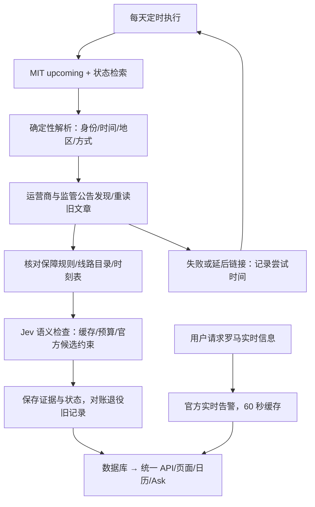

# Italy Strike：旧版到当前版的更新清单

核对日期：2026-10-06。依据 Git、当前代码、Claude 的交接文档和本次只读生产库查询。不是根据聊天中的功能设想整理。

## 对照的版本

- 几个月前：`52c2e86`，2026-04-11。这是 3 月上线后、5 月以前的最后一个提交；旧产品主要服务米兰、罗马、都灵。
- 中间存档：`v1.0-pre-refactor` → `160ba83`；`v1.1-backend-refactor` → `e75cb9d`。它们便于重现 10 月重构前后，但不等于 4 月版。
- 本轮已经核验的后端运行版本：`6527caa`；最终核验文档提交 `a359546`。
- 本文阅读的 Claude 最新版本：`3e2440b`，其中 `06cb1ad` 已合入 PR #18。相对已核验后端，最新提交改变城市记忆、涂鸦公开读取和界面；Ask 与语义 QA 核心文件没有变化，Ask 分享链接移除了冗余 city 参数。
- 整理结束时正式域名指向 READY 部署 `dpl_21zDMHS4zPXcN2pF3Teh2mg3GkrS`，区域仍为 Frankfurt；它是 CLI 发布，平台元数据没有 Git SHA。不要把下午对 `6527caa` 的测试收据说成对这次最新界面部署的重新完整核验。
- 最后检查时 Claude 工作区已干净。本文仅统计已提交内容，不把未提交的设想算作已上线功能。

项目没有为这些每轮增量统一发布新的 package version；下面按能力分类，不虚构一个正式版本号。

## 抓取成功的内容是否已经入库

要分清三个步骤：网页能够访问 → 找到匹配公告 → 采用公告中的事实。只有最后一步通过日期、主体、地区、范围与来源校验，才会成为罢工证据；访问结果也可以单独作为跟进记录保存。

本次生产库查询范围：日期不早于 2026-10-06、非 `CANCELLED` / `STALE` 的记录。

| 来源 | 已验证的访问状态 | 生产库里实际保存了什么 | 本轮不能宣称什么 |
|---|---|---|---|
| Trenord | 正式环境可读 | 已接入官方索引和后续抓取逻辑；当前未来有效记录没有采用该域名的补充事实来源，也没有该域名的逐事件发现记录 | 不能说已经取得每场未来罢工的 Trenord 详情；当前没有对应未来事件并不需要制造记录 |
| easyJet | 正式环境可读；能提取独立的公开信息卡 | 1 条未来事件保存了官方页面 `FETCHED` 的发现记录；整体为 `NO_MATCH`，还没有采用 easyJet 官方补充事实 | 不能用抓到其他日期的旅行提示，代替 10/16 机组罢工的当次公告 |
| CGSSE | 正式环境可读 | **5 条未来有效记录保存了 CGSSE 来源**，涉及 ATM 公告投影和 ENAV；最后一轮同步取得 7 份 CGSSE 文档 | 保存来源不表示它必然覆盖运营商的更具体运行安排；差异仍保留 |
| Toscana Aeroporti | 正式环境公共 API 可读 | Firenze / Pisa 两条机场记录保存了发现结果；各有已抓取和延后链接，整体 `PARTIAL`；没有采用该域名的补充事实来源 | API 可访问不表示已经取得 10/16 的具体运行、航班或保障详情 |
| CTM | 正式环境可读 | 1 条未来记录保存了官方索引 `FETCHED` 的发现记录；没有采用该域名的补充事实来源 | 不能把旧 RSS 或不匹配的新闻作为当次公告 |

本次查询的最新成功同步仍为 `bc73223d-3eb5-4529-8edd-f7031000b16a`，完成于 2026-10-06 14:44:27 UTC：75 条主来源记录，59 次 upsert。它们包括过去或取消的记录，因此不等于 59 条未来用户卡片。

**准确的说法是：抓取能力和跟进结果已经落地，CGSSE 已有被采用的补充证据；其余四家不能统称为“当次公告事实都已入库”。**

## 完整更新清单

| 部分 | 4 月版 | 当前实现 | 给用户带来的变化 |
|---|---|---|---|
| 主来源获取 | 单一 MIT 列表，旧 HTTP 地址 | HTTPS；同时读取 upcoming 和带状态的搜索数据，校验页面结构和行数据 | 不再只看到新公告而漏掉延期、撤销等状态 |
| 公告身份 | 基于可变展示字段找旧记录、合并时段 | 官方公告身份生成 `source_key`，再按日期、地区、交通类型投影 | 修改时段覆盖同一场事件，不再因时段变化堆出旧全天卡 |
| 对账 | 主要写入，缺乏完整快照退役 | 成功快照对账；消失的旧记录退役，明确取消保留取消状态，重现可恢复 | 减少幽灵罢工，历史和关联数据仍可追踪 |
| 数据健康 | 主要依赖同步接口成功与否 | 持久同步日志、锁、超时运行回收、健康与数据完整度分开 | 数据停更或抓取异常不能伪装成“没有罢工” |
| 失败隔离 | 核心与补充逻辑混在一起 | 主数据优先；补充抓取、规则、线路、AI 有阶段时间预算与降级 | 一个运营商超时不会轻易拖垮整站更新 |
| 时间解析 | 读不懂时回退全天；合并容易保留全天 | 行业分段、跨日拆分、多个窗口；未知保留未知，具体公告可补足 | 24 小时行动不再自动等于旅客服务全天停运 |
| 运营边界 | 普通数字窗口，难表示收车 | 原样保留运营开始／运营结束；另加有来源的时刻表参考 | 能取得可靠末班数字时给数字，同时保留罢工公告原义 |
| 地区判断 | 三城映射和文本推断较粗 | 20 城统一 registry；行政范围、机构名称、机场地理、支持城市投影分开 | Bergamo 不再并入 Milan；区域罢工不会被描述成只影响本站某个城市 |
| 覆盖外地点 | 容易与未知地区混淆 | `UNSUPPORTED_CITY` 与 `UNKNOWN_LOCATION` 区分；Foggia / Udine / Start Romagna 也有官方发现渠道 | 知道地点但没有城市入口，不再误说“官方地点不明” |
| 交通主体 | TRAIN / SUBWAY / BUS / AIRPORT 四大类 | 保留四类兼容；加航空与铁路 subtype、旅客影响字段 | 机组、货运、地勤、混合机场服务、安保、基础设施、客服与普通运营罢工有区别 |
| TPL 识别 | 地方公共交通容易归成公交 | 能识别 EAV DTF 等铁路部门；交通方式与 MIT 行业大类分开 | 地方铁路不会仅因 TPL 分类被显示成公交 |
| 全国范围 | 粗粒度全国标签易扩散 | 具体机场和主体优先；综合罢工的排除行业逐项处理 | Venice 不会扩散成全国机场，排除交通的总罢工不生成交通卡 |
| 二级核验 | `fetchSecondarySource()` 主要返回 null；有一次性静态补充 | 真实运营商索引、文章、附件、监管公告和受限的报道发现；严格匹配 | 公告发布更细的时段、线路、保障后，可以持续补充 |
| 来源优先级 | 来源标签粗，难追踪采用原因 | 当次运营商运行公告优先；保留 MIT / CGSSE / 报道和冲突；同等级冲突不硬选 | 看到的结论可以追溯，媒体信息不会被冒充官方确认 |
| 抓取兼容 | 普通 HTML 抓取 | 有限重定向、内容/体积/超时检查、CGSSE 验证 TLS、Toscana 公共 API、easyJet 公开信息卡 | 恢复部分官网访问，同时不执行网页脚本或绕过人机验证 |
| 保障时段 | 按大类和地区套常规值，来源不清 | 当次公告、运营商规则、标准规则、未知分开；六类有来源 profile，按服务和日期限定 | 常规保障不会说成当天已确认，也不会承诺所有班次正常 |
| 受影响范围 | 没找到线路时可能默认“全部线路” | `SPECIFIC_LINES` / `ALL_OPERATOR_LINES` / `ALL_EXCEPT` / `UNKNOWN`，另保留网络和人员范围 | “没公布线路”与“全运营商线路可能受影响”可以区分 |
| 具体线路 | 主要存一个文字数组 | 官方范围连接官方线路目录／GTFS，生成有证据的 `potentialLines` | 可给出 M1–M5、公交具体编号，而不是只显示运营商名称 |
| 线路标准身份 | 没有完整 feed 身份链 | operator、mode、feed、route_id、有效期；GEST T1 ↔ T1.3 有限定别名和续验 | 线路查询、后续实时匹配有可靠身份；拒绝通用模糊匹配 |
| 时刻表 | 缺少可追溯的线路级参考 | 日历例外、服务日期、首班、末班始发、最后到达、次日偏移分别计算 | 次日 00:32 不会被当成当天 00:32，最后到达不冒充末班发车 |
| 行程线路接口 | 城市罢工列表 | `/api/line-impact` 按城市、日期、方式、可选线路筛选，配套人员范围单独保留 | 只返回与用户所选线路有关的证据和可能影响 |
| 实时信息 | 没有独立实时罢工核验链 | 罗马官方 GTFS-RT 按需读取；区分原因、有效期和新鲜度 | 有真实、新鲜、罢工原因的告警才确认实时影响；无告警不等于正常 |
| AI 后台检查 | 没有结构化语义 QA | Jev 比对官方原始字段与 parser，有限候选修正、疑点队列、缓存 | 给机构名称、地区与人员语义增加一道检查 |
| AI 用户查询 | 没有当前 Ask 决策管线 | Claude 的结构化 Ask：理解 → 检索 → 逐项相关性 → 证据；代码控制时间与结果 | 一句话查行程／单日／时间段／消息，而不是让 AI 编一段罢工新闻 |
| AI 费用 | 没有现有的跨功能共享账本 | Ask 和后台 QA 共用原子月度 USD 0.20 账本，预留后才调用 | 并发请求不能各自拿一份预算；预算或计费异常阻止继续付费 |
| 翻译 | 有 DeepL 翻译 | 同步只允许 DeepL 免费 API；无钥匙、失败或非免费 URL 时保留原文；新版批量模型翻译已关闭 | Gemini 及付费替代翻译已去除；并非全部公告都已有双语人工质量翻译 |
| API 防护 | 输入、权限和频率限制较薄 | 有限请求体、白名单、共享限流、私有反馈／会话／绘画存储、错误清洗 | 不把数据库原始错误和服务密钥暴露给浏览器 |
| 城市读取与缓存 | 列表、日历各自处理较多 | 统一读取/证据/聚合；读取健康在缓存外检查，同步使页面缓存失效 | 降低重复查询并避免健康检查被旧缓存掩盖 |
| 日历 | 已存在 ICS 订阅 | 保留订阅，修复文本转义，并携带范围、符号时段、保障来源 | 订阅内容更准确、兼容更多日历应用；不是这轮才新增日历 |
| 新版页面 | 原三城 Dashboard / StrikeCard | Claude 的新版已成为城市主页；时间条、来源、声明/可能影响语义与后台证据接线 | 信息层次和交互改变，仍保留底部来源、罢工进度和日期入口 |
| Ask 界面 | 无该功能 | 阶段进度、假设、来源、排除记录、查询历史、反馈、追问 | 用户能看到查了什么、用了什么假设以及为什么排除某条 |
| 小组件 | 已有小组件 | 新版组件沿用后台数据和证据，更新绘制与时间条 | 属于升级，不应写成“从无到有” |
| 绘画／涂鸦 | 不具有当前的共享画墙后端 | 服务端串行领格、一次保存；Claude 按用户要求让所有已保存绘画公开，墙可见时每 30 秒刷新 | 真实共享绘画同步；固定种子背景画与真实用户绘画不同，不应当作用户人数；审核字段仍保留，但不是展示前审批 |
| 城市记忆与分享 | 普通城市切换 | 记住自行选择的城市，裸首页回到该城市；分享日期链接不修改这项偏好；Ask 分享使用城市路径 | 下次更快回到自己的城市，分享链接仍能定位日期 |
| 工程协作 | 未具备当前交接约定 | 独立 worktree/branch、PR、`AI_HANDOFF.md`、存档和生产核验收据 | Claude 的前端与 Codex 后端共享同一套事实和接口约束 |
| 验证 | 4 月 package 没有当前回归测试入口 | 最近运行记录为 311 项回归、类型/构建检查、65 项公开端点检查，外部事实双向核对 | 不只看“同步成功”，还核对数据库、API 和实际数据语义 |

“我受影响了”计数的行为按用户要求保留；不要把本轮安全和存储改动误写成计数产品规则重做。

## 现在怎样持续更新

| 数据 | 当前更新方式 | 限定 |
|---|---|---|
| 主公告、修改、取消、消失对账 | 每日 cron：05:00 UTC | 不是每小时；意大利夏令时约 07:00、冬令时约 06:00 |
| 运营商、监管、附件、已匹配旧文章 | 每日同步继续发现和读取，失败／延后按尝试年龄排队 | 近期 90 天补充范围；无 operator 的公告继续 MIT / 监管跟进 |
| 官方线路目录、GTFS、时刻表 | 按日切换缓存周期，在相关事件需要时获取 | 并非所有城市所有方式都有适配器；过期时刻不能补成数字 |
| 固定保障 profile | 按周重新获取并验证，合格才延长核验窗口 | 核验窗口不是法律有效期；核验失败且过期后变未知 |
| GEST canonical alias | 随目录与当前官方线路身份一起续验 | operator、线路终点与日期都要成立 |
| Jev QA | 同步时审查未来范围，输入 hash + 24 小时缓存 | 不是“没改过就永久不再审查”；缓存过期可以复审，受预算限制 |
| 罗马实时告警 | 用户请求触发，60 秒缓存 | 没有全国后台每分钟采集，也没有全国实时覆盖 |
| 页面数据 | 同步刷新服务端缓存；新版页面长时间离开后恢复可见会刷新 | Ask 会话里相同问题可能直接重放旧答案，不能认为它每次都查了新数据 |
| 共享涂鸦墙 | 墙在屏幕内且标签页可见时，每 30 秒请求 | 独立于罢工主数据同步；种子背景不是用户提交数据；原计数按既有 5 秒方式更新 |

本次生产库查询：34 条未来有效记录，34 条 DAILY 主来源计划；25 条有运营商／主管部门公告计划，9 条 `PRIMARY_ONLY`。计划是再次检查的路径，不是已经再次核验成功的证明。

## AI 的完整说明

详见 [AI 逻辑与决策分支说明](2026-10-ai-decision-architecture.md)。其中分别列出 Claude Ask 的全部主路由、每次模型问题数量、影响计算、降级、费用，以及后台 QA 的七个问题、自动修正条件和五种处理结果。

## 仍然不能写成“已经完成”的部分

1. 5 条未来事件的具体时段仍未知；不能凭“24 小时”或常规规则填出当次运行时段。
2. Brescia / Venice 的云端访问仍 403；ATAC 直站有人机验证，Roma Mobilità 只是补充渠道。
3. 20 城是产品入口范围，不是全国每个城市都有完整运营商、线路目录、保障和实时适配器。
4. `potentialLines` 是有官方范围依据的潜在线路，不是停运名单。静态 GTFS 不是实时运行证明。
5. 旅客保障列车／航班的具体清单未取得时继续未知；人员配套罢工不套普通铁路保障。
6. 完整 maritime / highway / freight-road 模型尚未建立。
7. AI 的概率是模型返回的判断值；没有这套产品的标注数据集证明其校准准确率，不能说“97% 就必然对”。
8. Ask 当前没有完整线路级行程规划，也没有直接复用全部 `potentialLines` / 实时结果作答案；细节见 AI 文档。
9. Claude 尚未提交的界面工作和旧设计文档中的动作建议分支，不算当前已发布能力。

## 核查依据

- 旧代码：`git show 52c2e86:lib/strikeSync.ts`、cron route、components/utils.ts、package.json。
- 当前代码：`lib/strikeSync.ts`、`strikeEnrichment.ts`、`strikeScope.ts`、`lineImpact.ts`、`serviceSchedule.ts`、`transitEnrichment.ts`、`strikeQuery.ts`、`lib/ask/*`、`strikeSemanticReview.ts`。
- Claude 原型：[2026-10-ai-ask-design.md](archive/2026-10-ai-ask-design.md)；它是历史方案，具体阈值和请求内容以现代码为准。
- 最近生产证据：[source-followup audit](2026-10-06-source-followup-audit.md) 和 `verification/2026-10-06-source-followup-*.json`。
- 本次只读库查询核实了来源采用、发现日志、34 条跟进计划及最新同步；没有触发同步、付费 AI 或修改业务数据。
